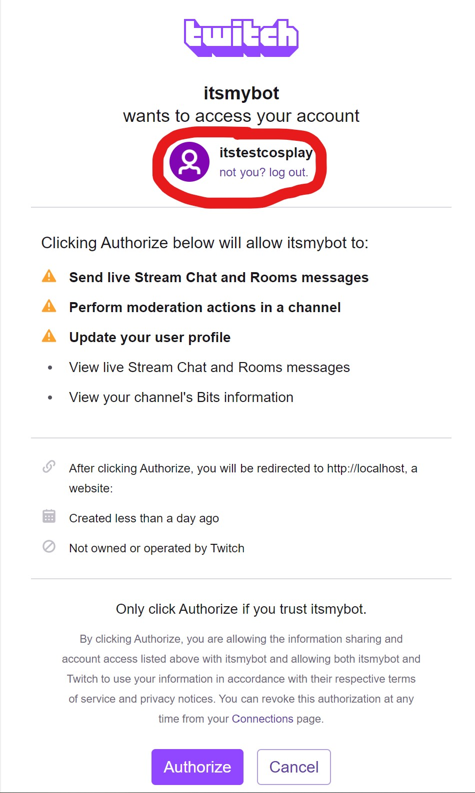

# Creating your Application

To be able to use twitch API, you need to create an application.  
Use Twitch API to read followers, subscribers and other public stats from twitch.  
Go to 
https://dev.twitch.tv/console/apps/create  
and connect a user to it, can be yours or any account you manage.  
This will not be the account we will be using to chat as a bot.  


Give it a name

Add http://localhost in OAuth redirect URLs.  

Select Chat Bot as category.


# Manage your Application
Once created now you can grab your Client-ID and Secret paste on appsettings.json  
```
  "itsmybotappclientid": "GET_FROM_TWITCH_APP_CLIENT_ID",
  "itsmybotappsecret": "GET_FROM_TWITCH_APP_SECRET"
```

Now to Grab your access token to enable the bot to impersonate and chat for you or your bot user use the url below at your browser
```
https://id.twitch.tv/oauth2/authorize?client_id=REPLACE_BY_APP_CLIENT_ID&redirect_uri=http://localhost&response_type=token&scope=chat:read+chat:edit+channel:moderate+bits:read+user:edit
```
Make sure to login with the user you want to be the one that will be talking as bot for you.

This will return and replace the url with something similar to this:
```
http://localhost/#access_token=COPY_THIS_CODE&scope=chat%3Aread+chat%3Aedit+channel%3Amoderate+bits%3Aread+user%3Aedit&token_type=bearer
```

Copy the code between access_token= and & and paste on:
```
"botAccessToken": "GET_FROM_URL"
```

Then change the channelName with the channel you want to connect to and the botUserName:
```
"channelName": "itsmychannel",
"botUserName": "itstestcosplay",
```

# Running your Bot

Download dotnet  
[Dotnet](https://download.visualstudio.microsoft.com/download/pr/a105fe06-20a0-4233-8ff1-b85523b40f1d/5f26654016c41ab2dc6d8bc850a9bf4c/dotnet-sdk-5.0.200-win-x64.exe)

Then navigate to the folder ItsMyBot.Worker and open a command line and run
```
dotnet run
```

Check Commands.cs file for the list of commands used.  

## Running this sample giveaway in your channel 
First run `!resync` to update the followers file with your channel followers.  
Then add in the giveawayentries.json the list of entries you have by user name.  
Adding multiple times the same name will increase the odds of that person.  
Run `!draw` to calculate the winner.
