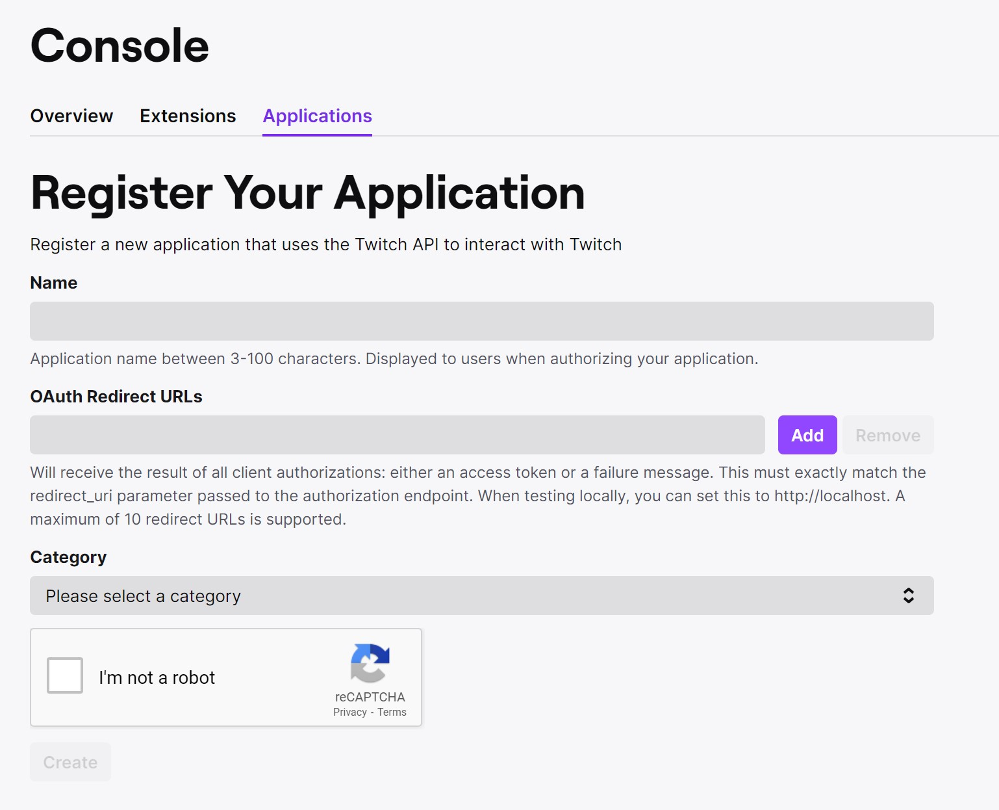
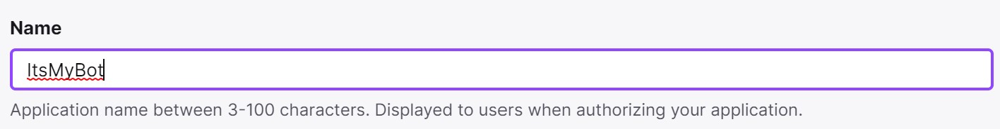
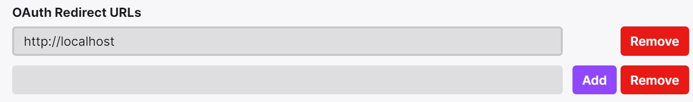
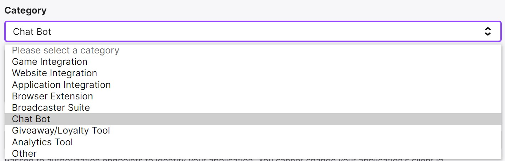

# Creating your Application

To be able to use twitch API, you need to create an application.  
Use Twitch API to read followers, subscribers and other public stats from twitch.  
Go to 
https://dev.twitch.tv/console/apps/create  
and connect a user to it, can be yours or any account you manage.  
This will not be the account we will be using to chat as a bot.  


Give it a name

Add http://localhost in OAuth redirect URLs.  

Select Chat Bot as category.


# Manage your Application
Once created now you can grab your Client-ID and Secret paste on appsettings.json  
```
  "itsmybotappclientid": "GET_FROM_TWITCH_APP_CLIENT_ID",
  "itsmybotappsecret": "GET_FROM_TWITCH_APP_SECRET"
```

Now to Grab your access token to enable the bot to impersonate and chat for you or your bot user use the url below at

https://id.twitch.tv/oauth2/authorize?client_id=REPLACE_BY_APP_CLIENT_ID&redirect_uri=http://localhost&response_type=token&scope=chat:read+chat:edit+channel:moderate+bits:read+user:edit